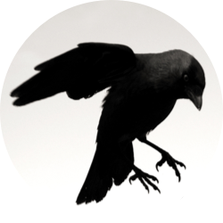

# [](https://github.com/geppetto-apps/crow)

[](https://circleci.com/gh/geppetto-apps/crow)
[](https://shards.rocks/github/geppetto-apps/crow)
[](https://shards.rocks/github/geppetto-apps/crow)

# crow

`crow` transpiles [Crystal][cr] source code to valid [Flow][flow]/ES2015/JavaScript.

Code that is transpiled to valid Flow syntax may be transpiled to valid ES2015,
which may be transpiled to Javascript (via [Babel][babel]).

## Warning: Experimental

This project is in alpha stage and should be considered highly experimental.

## Installation

Via [Homebrew][brew]:

```
brew install geppetto-apps/bin/crow
```

Via [npm][npm]:

```
npm install crow-cli -g
```

## Usage

```sh
# Compiles and outputs to foo.js.flow
$ crow foo.cr

# Same as above
$ cat foo.cr | crow > foo.js.flow

# Compile to JavaScript (via Babel)
$ npm install babel-preset-es2015 babel-plugin-transform-flow-strip-types
$ cat foo.cr | crow | babel --plugins transform-flow-strip-types --presets es2015
```

You can also use [Docker][docker]:

```sh
$ cat foo.cr | docker run -i geppettoapps/crow > foo.js.flow
```

## Motivation & Goal

This is both my first Crystal and first compiler project. I was inspired to learn
more about compilers after reading [Game Programming Patterns' chapter on bytecode][gpp-bytecode]
and also Crystal and its relationship with LLVM. Since Crystal is a high-level,
self-hosted programming language, it's very easy to work with Crystal's internals.
In addition to attempting make Crystal target the web, I've learned a lot about
Crystal from working on this project.

The goal of this project is to make it possible to write both frontend and backend
code for a web project in Crystal; preferably in a way that allows for communication
between native JS and native Crystal code. @asterite from the Crystal Team has
noted that [crystal is not geared against the web](https://github.com/crystal-lang/crystal/issues/829#issuecomment-113955554)
and there's still work left to [make Crystal to work with asm.js][asm-issue].
Due to this `crow` currently approach the problem by using transpilation, but that
may not be the case forever. The only public API for `crow` is the CLI that takes
in some Crystal code and spits out something may run in the browser.

## Milestones

- [ ] [1.0: Run Crystal code in isolation in the browser](https://github.com/geppetto-apps/crow/milestone/1)
- [ ] [1.1: DOM manipulations from Crystal code](https://github.com/geppetto-apps/crow/milestone/2)
- [ ] [1.2: Bind Crystal code to DOM events](https://github.com/geppetto-apps/crow/milestone/3)
- [ ] [1.3: Call Crystal code from Javascript](https://github.com/geppetto-apps/crow/milestone/4)
- [ ] [1.4: Call non-DOM related Javascript code from Crystal ](https://github.com/geppetto-apps/crow/milestone/5)

## Supported AST nodes

Extracted from [Crystal's compiler][cr-parser].

- [x] Expressions
- [x] NilLiteral
- [x] BoolLiteral
- [x] NumberLiteral
- [x] CharLiteral
- [x] StringLiteral
- [x] StringInterpolation
- [x] SymbolLiteral
- [x] ArrayLiteral
- [x] HashLiteral
- [x] NamedTupleLiteral
- [ ] ProcLiteral
- [ ] RangeLiteral
- [ ] RegexLiteral
- [ ] TupleLiteral
- [x] Var
- [x] Block
- [x] Call
- [ ] NamedArgument
- [x] If
- [x] Unless
- [ ] IfDef
- [x] Assign
- [ ] MultiAssign
- [x] InstanceVar
- [ ] ReadInstanceVar
- [ ] ClassVar
- [ ] BinaryOp
- [ ] Arg
- [x] ProcNotation
- [x] Def
- [ ] Macro
- [ ] UnaryExpression
- [ ] VisibilityModifier
- [x] IsA
- [ ] RespondsTo
- [ ] Require
- [x] When
- [x] Case
- [ ] ImplicitObj
- [ ] Path
- [x] While
- [x] Until
- [ ] Generic
- [ ] TypeDeclaration
- [ ] UninitializedVar
- [x] Rescue
- [x] ExceptionHandler
- [ ] ProcPointer
- [ ] Union
- [x] Self
- [ ] ControlExpression
- [ ] Yield
- [ ] Include
- [ ] Extend
- [ ] EnumDef
- [x] ClassDef
- [ ] ModuleDef
- [ ] LibDef
- [ ] FunDef
- [ ] TypeDef
- [ ] CStructOrUnionDef
- [ ] ExternalVar
- [x] Alias
- [ ] Metaclass
- [ ] Cast
- [ ] NilableCast
- [ ] TypeOf
- [ ] Attribute
- [ ] MacroExpression
- [ ] MacroIf
- [ ] MacroFor
- [ ] MacroVar
- [ ] MacroLiteral
- [ ] Underscore
- [ ] MagicConstant
- [ ] Asm
- [ ] AsmOperand

## Contributing

1. Fork it ( https://github.com/geppetto-apps/crow/fork )
2. Create your feature branch (git checkout -b my-new-feature)
3. Commit your changes (git commit -am 'Add some feature')
4. Push to the branch (git push origin my-new-feature)
5. Create a new Pull Request

## Attribution

Logo: [Crow by Encrico Francese][crow-flickr]

## Contributors

- [theodorton](https://github.com/theodorton) Theodor Tonum - creator, maintainer

[cr]: https://crystal-lang.org/
[cr-src]: https://github.com/crystal-lang/crystal
[cr-syntax]: https://github.com/crystal-lang/crystal/blob/master/src/compiler/crystal/syntax/ast.cr
[docker]: https://www.docker.com/
[flow]: https://flowtype.org/
[babel]: https://babeljs.io/
[npm]: https://www.npmjs.com
[brew]: http://brew.sh/
[crow-flickr]: https://www.flickr.com/photos/remanufactory/5553711670
[gpp-bytecode]: http://gameprogrammingpatterns.com/bytecode.html
[asm-issue]: https://github.com/crystal-lang/crystal/issues/535
